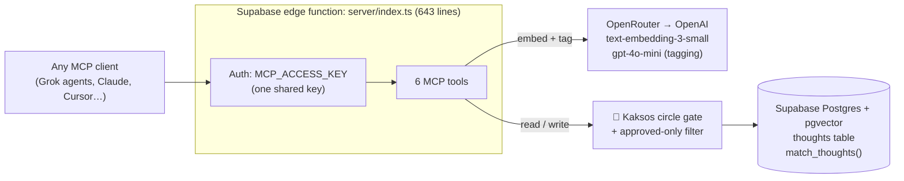

# Kaksos Open Brain: Architecture Key

How the fork is built inside. For how it fits into the wider vessel, see `SYSTEM_KEY.md`.
Draft, 9 Oct 2026, based on upstream OB1 `main`. **Status legend:** ✅ in repo as upstream · 🛠 prepared · 💭 Kaksos plan (not built)

## 1. The engine ✅
| Part | What it is |
|---|---|
| `server/index.ts` | 643 lines of TypeScript running as a Supabase edge function (Deno), built on the official MCP SDK with Hono for HTTP |
| Env vars | `SUPABASE_URL`, `SUPABASE_SERVICE_ROLE_KEY`, `OPENROUTER_API_KEY`, `MCP_ACCESS_KEY`, `OPEN_BRAIN_CITATION_BASE_URL` (template in `setup/server.env.example`) |
| AI dependency | Calls go through OpenRouter to OpenAI: `text-embedding-3-small` turns text into a 1536-number meaning fingerprint, and `gpt-4o-mini` auto-tags people, topics, to-dos and type |

## 2. The six tools ✅
| Tool | Job |
|---|---|
| `search` | Meaning search (standard connector name) |
| `fetch` | Get one thought by id |
| `search_thoughts` | Meaning search with filters |
| `list_thoughts` | Browse recent thoughts |
| `thought_stats` | Counts and summaries |
| `capture_thought` | Save a new thought (embedded and tagged on the way in) |

## 3. The data ✅
- **Core SQL** lives inside `docs/01-getting-started.md` and is extracted to `setup/01_thoughts_schema.sql`.
- **`thoughts` table:** `id`, `content`, `embedding vector(1536)`, `metadata jsonb`, `created_at`, `updated_at`, with HNSW (meaning), GIN (tags) and date indexes.
- **`match_thoughts()`:** returns the closest thoughts above 0.7 similarity, 10 by default, with an optional tag filter.
- **`schemas/`:** 17 optional add-ons (56 files), e.g. `agent-memory`, `per-agent-identity`, `provenance-chains`, `thought-audit`, `recency-boosted-match-thoughts`, `text-search-trgm`, `enhanced-thoughts`, `smart-ingest`.

## 4. The agent add-on ✅ (in repo, not switched on)
| Rule | Where |
|---|---|
| Own revocable key per agent (SHA-256 hashed) | `schemas/per-agent-identity` |
| Agent writes start as **evidence**, review `pending`; a DB constraint lets memory become an instruction only once user-confirmed | `schemas/agent-memory` + `integrations/agent-memory-api` |
| Every recall logged as a trace (`/recall-traces/:id`) | `integrations/agent-memory-api` |

## 5. Folder layout ✅
| Folder | Contents |
|---|---|
| `server/` | The core engine (4 files) |
| `docs/` | Setup guides, FAQ, design notes |
| `schemas/` | Optional database add-ons |
| `recipes/` | Largest folder: step-by-step add-ons |
| `integrations/` | Capture and connectors (e.g. Slack, agent-memory API) |
| `skills/` | Reusable AI skills |
| `extensions/` | Bigger feature add-ons |
| `primitives/` | Shared building blocks |
| `dashboards/` | Web views over the brain |
| `setup/` | 🛠 Our Kaksos prep files (this branch only) |

**Root guides:** `README.md` is the overview. `AGENTS.md` tells AI agents to work in one git worktree per agent or task, never a shared checkout. `CLAUDE.md` is instructions for AI coding tools (Claude Code, Codex, Cursor) on what the repo is and how to contribute.

## 6. Kaksos circle gating 💭
Nate's model is one person and one shared key, and the service-role key bypasses row-level security, so anyone holding the key sees everything. Kaksos replaces that with:

| Circle | Access (Kaksos definition) |
|---|---|
| CENTER | Full access to all information |
| INNER | High trust: business and professional information |
| MID | Moderate trust: business basics only |
| OUTER | Basic trust: public information only |
| PUBLIC | No prior relationship: very limited |

**Plan:** every thought carries a circle and an approval status. Each agent key maps to a maximum circle, and `match_thoughts()` filters to "approved, not boundary, circle ≤ caller's circle" *before* ranking by meaning, so no tool can skip the gate.

**Watch-outs from the circles review:** a sixth level, `network`, exists in one table, and some code spells `centre` where the database uses `center`.

Nothing is deployed or running.
