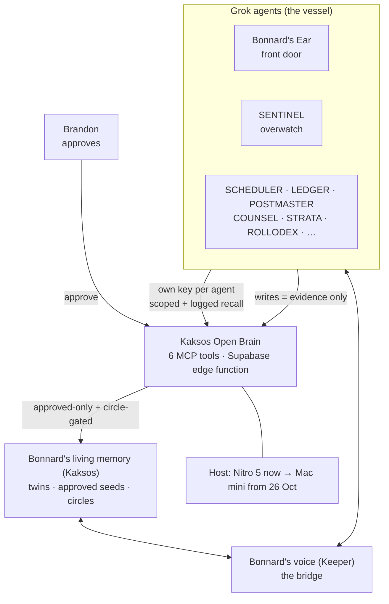

# Bonnard System Key

Draft, 9 Oct 2026. **Status legend:** ✅ live · 🛠 prepared (not running) · 💭 planned

## 1. Bonnard's living memory, the core ✅
- **Holds:** each Kaksos twin, its seeds (99 seed questions plus conversation seeds, including twin-to-twin), and circle levels.
- **Rule:** a seed belongs to the twin only after the account holder approves it.
- **Access:** kaksos-api on Google Cloud (35 tables) and the Kaksos portal.
- **Open defect:** public chat can draw unapproved or boundary seeds; fix it before wiring anything in.

## 2. Bonnard's voice (Keeper), the bridge 💭
- The one connection between Bonnard and the vessel; it relays only and never speaks as Bonnard unless Brandon turns that on.
- Planned to link directly into the living memory.

## 3. Grok agents, the vessel 💭
| Rule | Meaning |
|---|---|
| Own key per agent | Every agent authenticates separately, with no shared key |
| Scoped recall | An agent sees only the circles it's allowed |
| Logged recall | Every read records which agent asked what, and when |
| Evidence until approved | Agent writes wait as evidence until Brandon approves them |

These rules come from OB1's agent-memory add-on and aren't built yet.

## 4. Kaksos Open Brain, the reasoning layer 🛠
- **Repo:** `BrandonMathews/kaksos-open-brain`, branch `kaksos-prep` (fork of NateBJones-Projects/OB1).
- **Server:** `server/index.ts`, a Supabase edge function.
- **6 MCP tools:** `search`, `fetch`, `search_thoughts`, `list_thoughts`, `thought_stats`, `capture_thought`.
- **Storage:** one `thoughts` table (text, embedding, metadata) searched by meaning with `match_thoughts`.
- **Kaksos change (planned):** the approved-only filter and circle gating go inside `match_thoughts`, replacing Nate's single-person, single-key model in which the service key bypasses row-level security.

## 5. Deployment path 💭
| Stage | Where | Notes |
|---|---|---|
| Now | Nitro 5 (i9-12900H, 32GB, RTX 3060) | Plenty of headroom alongside the voice clone, but it sleeps and travels |
| From Mon 26 Oct | Mac mini M5 Pro, 64GB, 1TB (pickup Apple Robina) | Always-on home |
| Agent side | No changes | Agents keep the same endpoint and keys; only the host moves |

Nothing is deployed or running yet. Items marked 🛠 or 💭 still need Brandon's go-ahead.
